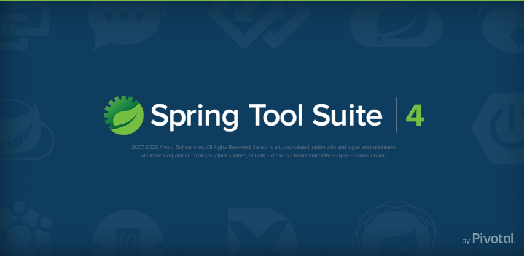
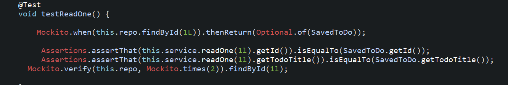
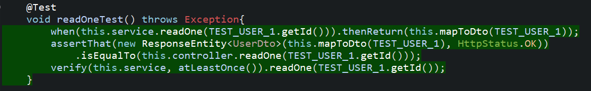

Coverage: 60%
# To Do Project

This To Do Web Application is created in Spring using a SQL Server to host a database containing To Dos and Users as well as the ability to carry out CRUD functionality.

## Getting Started

These instructions will get you a copy of the project up and running on your local machine for development and testing purposes. See deployment for notes on how to deploy the project on a live system.


### Prerequisites

What things you need to install the software and how to install them
1. Java14
2. Spring
3. Maven
4. Git

To ensure you have javan and maven installed, run the following lines in your terminal
```
java -version
mvn -version
```

### Installing

1. Git bash into your folder and clone this repository down for you to use.

Use this line
```
git clone https://github.com/parthpatel-qa/ToDos.git
```

2. Open this project in your desired IDE

```
In Spring that would be File>Import>Maven>ExistingMavenProjects>Find the file>Finish
```
<p align="center">

</p>


3. I have set the Database URL to a local host but you can change it to anything you require in src/main/resources/application.properties
```
serverport = 9092
```

4. Open the application on your browser
```
localhost://9092
```


## Running the tests

This project consisted of JUnit and Mockito Testing and were aiming for the industry standard of 80%.

### Unit Tests 

The two main test suites are 'Service' and 'Controller' and can be found under

```
src/test/java
```

#### Service
The Service suites were testing with JUnit and look as such

<p align="center">

</p>

#### Controller
Mockito was used to test these Controllers and looks as such

<p align="center">

</p>

## Deployment

To deploy this system from outside your IDE you can navigate from Git to the Documentation folder to find the .jar file
Use the following command to start the program
```
java -jar ToDoProject.jar
```
From here you can run the system as was described in the 'Installing' heading.

## Built With

* [Maven](https://maven.apache.org/) - Dependency Management


## Authors

* **Parth Patel** - [Parth Patel](https://github.com/parthpatel-qa/)

## License

This project is licensed under the MIT license - see the [LICENSE.md](LICENSE.md) file for details 

*For help in [Choosing a license](https://choosealicense.com/)*

## Acknowledgments

* Vinesh Ghela for helping with my project.
* Ed Reynolds for helping with my project.
